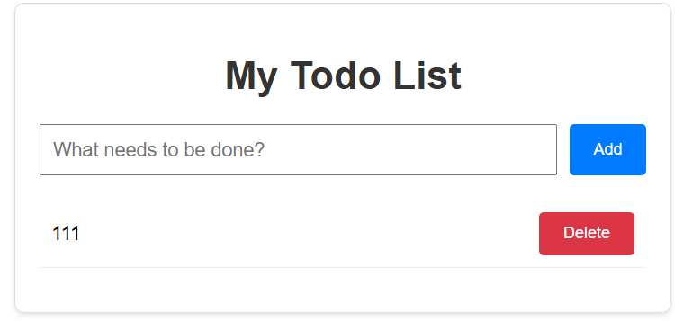

# Todo Fullstack GitOps

Todo Fullstack GitOps 是一个完整的全栈 Web 应用原型，采用 GitOps 理念设计和部署，展示了如何使用现代 DevOps 工具链构建、部署和管理一个完整的 Web 应用，涵盖了从开发到生产环境的全流程。



## 项目特点

- **模块化设计**：前后端分离，便于独立开发和部署
- **容器化实现**：所有组件均容器化，确保环境一致性
- **GitOps 实践**：代码即基础设施，自动化部署和同步
- **多环境支持**：支持开发、测试和生产环境的部署
- **支持多种部署方式**：Docker Compose、Kubernetes、Helm Chart
- **可扩展性**：使用 Kubernetes 和 Helm 实现应用的水平扩展

## 技术栈

### 前端

- **框架**: React
- **构建工具**: Vite
- **样式**: CSS
- **容器化**: Docker + Nginx

### 后端

- **框架**: Flask (Python)
- **数据库**: MySQL
- **ORM**: SQLAlchemy
- **迁移工具**: Flask-Migrate (Alembic)
- **API**: RESTful API
- **容器化**: Docker

### 部署

- **容器编排**: Docker Compose, Kubernetes
- **GitOps**: Argo CD
- **包管理**: Helm
- **CI/CD**: GitLab CI

## 项目结构

```
todo-fullstack-gitops/
│
├── argo-cd/               # Argo CD 部署配置
│   ├── chart-app.yaml     # Helm Chart Argo CD 应用配置
│   └── k8s-app.yaml       # Kubernetes Argo CD 应用配置
│
├── backend/               # 后端代码目录
│   ├── app/               # 后端应用目录
│   │   ├── api/           # API 路由目录
│   │   │   ├── __init__.py   # API 蓝图文件
│   │   │   └── rutes.py      # API 路由文件
│   │   ├── __init__.py    # 后端应用初始化文件
│   │   └── models.py      # 数据库模型文件
│   ├── migrations/        # 数据库迁移目录
│   ├── boot.sh            # 后端启动脚本
│   ├── config.py          # 后端配置文件
│   ├── Dockerfile         # 后端 Docker 镜像构建文件
│   ├── requirements.txt   # 后端依赖列表
│   └── run.py             # 后端入口文件
│
├── frontend/              # 前端代码目录
│   ├── src/               # 前端应用代码
│   │   ├── App.css        # 主组件样式表
│   │   ├── App.jsx        # 主组件
│   │   └── main.jsx       # 前端入口文件
│   ├── Dockerfile         # 前端 Docker 镜像构建文件
│   ├── index.html         # 前端入口 HTML 文件
│   ├── nginx.conf         # 前端请求反向代理（容器化环境）
│   ├── package.json       # npm 依赖
│   └── vite.config.js     # 前端请求代理（本地环境）
│
├── k8s/                   # Kubernetes 部署文件
│   ├── backend.yaml       # 后端部署配置
│   ├── frontend.yaml      # 前端部署配置
│   ├── mysql.yaml         # MySQL 部署配置
│   └── namespace.yaml     # 命名空间配置
│
├── todo-chart/                  # Helm Chart 目录
│   ├── templates/               # Kubernetes 资源模板目录
│   │   ├── namespace.yaml       # 命名空间配置模板
│   │   ├── _helpers.tpl         # 模板函数
│   │   ├── mysql.yaml           # MySQL 部署配置模板
│   │   ├── backend.yaml         # 后端部署配置模板
│   │   └── frontend.yaml        # 前端部署配置模板
│   ├── Chart.yaml               # Chart 元数据
│   └── values.yaml              # 模板文件参数配置
│
├── .env                   # 环境变量（未推送至代码仓库）
├── .env.example           # 环境变量示例文件
├── .gitignore             # Git 忽略文件配置
├── .gitlab-ci.yml         # GitLab CI/CD 配置
├── docker-compose.yml     # Docker Compose 配置
└── README.md              # 项目说明文档
```

## 环境要求

- Docker 19.03+
- Docker Compose 3.8+
- Kubernetes 1.20+ (用于 K8s 部署)
- Helm 3.0+ (用于 Helm Chart 部署)
- Argo CD 2.0+ (用于 GitOps 部署)

## 快速开始

### 本地开发 (Docker Compose)

1. **准备环境变量**

   ```bash
   # 编辑.env文件，设置数据库密码等环境变量
   cp .env.example .env
   ```

2. **启动应用**

   ```bash
   docker-compose up -d
   ```

3. **访问应用**

   - 前端: http://localhost
   - 后端 API: http://localhost:5000/api

### Kubernetes 部署

1. **创建命名空间**

   ```bash
   kubectl apply -f k8s/namespace.yaml
   ```

2. **部署 MySQL**

   ```bash
   kubectl apply -f k8s/mysql.yaml -n todo
   ```

3. **部署后端**

   ```bash
   kubectl apply -f k8s/backend.yaml -n todo
   ```

4. **部署前端**

   ```bash
   kubectl apply -f k8s/frontend.yaml -n todo
   ```

5. **访问应用**

   ```bash
   # 获取前端服务的NodePort
   kubectl get svc frontend -n todo
   # 访问: http://<NodeIP>:<NodePort>
   ```

### Helm Chart 部署

1. **安装 Helm Chart**

   ```bash
   helm install todo-app ./todo-chart
   ```

2. **访问应用**

   ```bash
   # 获取前端服务的NodePort
   kubectl get svc todo-chart-frontend -n todo
   # 访问: http://<NodeIP>:<NodePort>
   ```

### GitOps 部署 (Argo CD)

1. **Kubernetes YAML 部署**

   ```bash
   kubectl apply -f argo-cd/k8s-app.yaml
   ```

2. **Helm Chart 部署**

   ```bash
   kubectl apply -f argo-cd/chart-app.yaml
   ```

## 数据库迁移

### 本地开发

```bash
# 进入后端容器
docker-compose exec backend bash

# 生成迁移文件
flask db migrate -m "描述迁移内容"

# 应用迁移
flask db upgrade
```

### 生产环境

数据库迁移会在应用启动时自动执行，无需手动操作。

## CI/CD

项目包含 GitLab CI 配置，实现了以下功能：

- 代码质量检查
- 自动化测试
- Docker 镜像构建
- 镜像推送到仓库
- Helm Chart 打包和推送

## GitOps 工作流

1. **代码变更**：开发者提交代码到 Git 仓库
2. **CI 触发**：GitLab CI 自动构建和测试
3. **镜像推送**：构建成功后推送 Docker 镜像
4. **Argo CD 同步**：Argo CD 监控 Git 仓库变更
5. **自动部署**：Argo CD 自动将变更部署到 Kubernetes 集群
